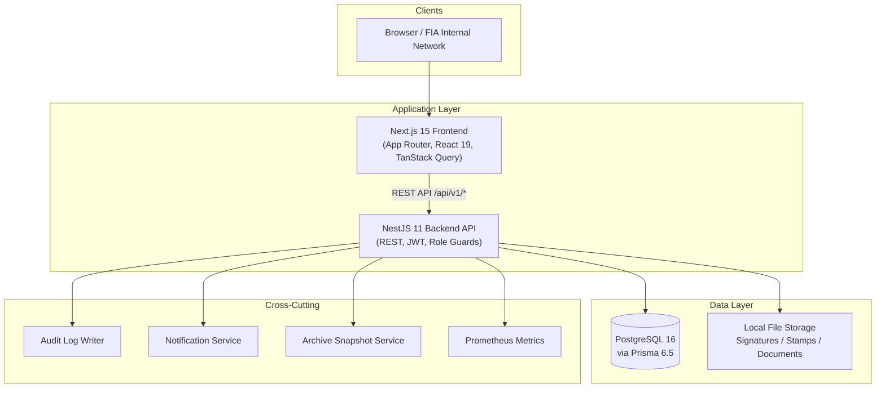
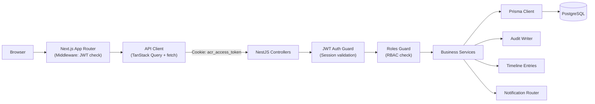
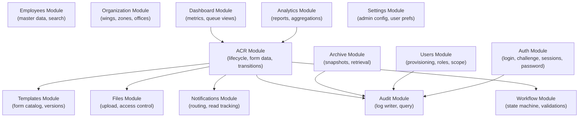
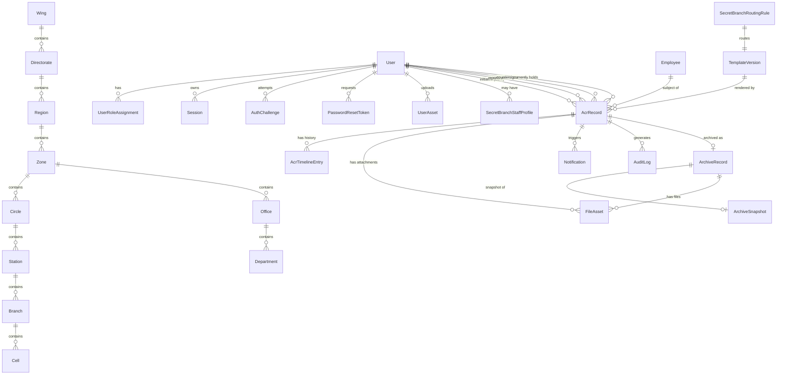
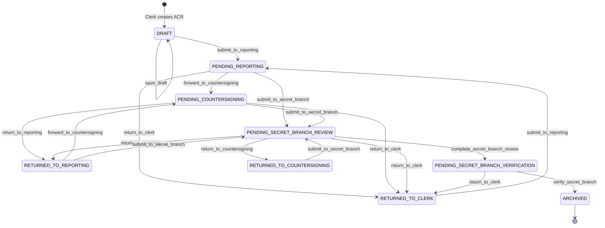
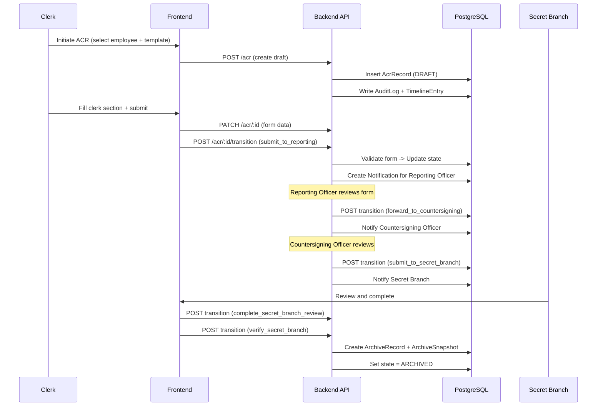
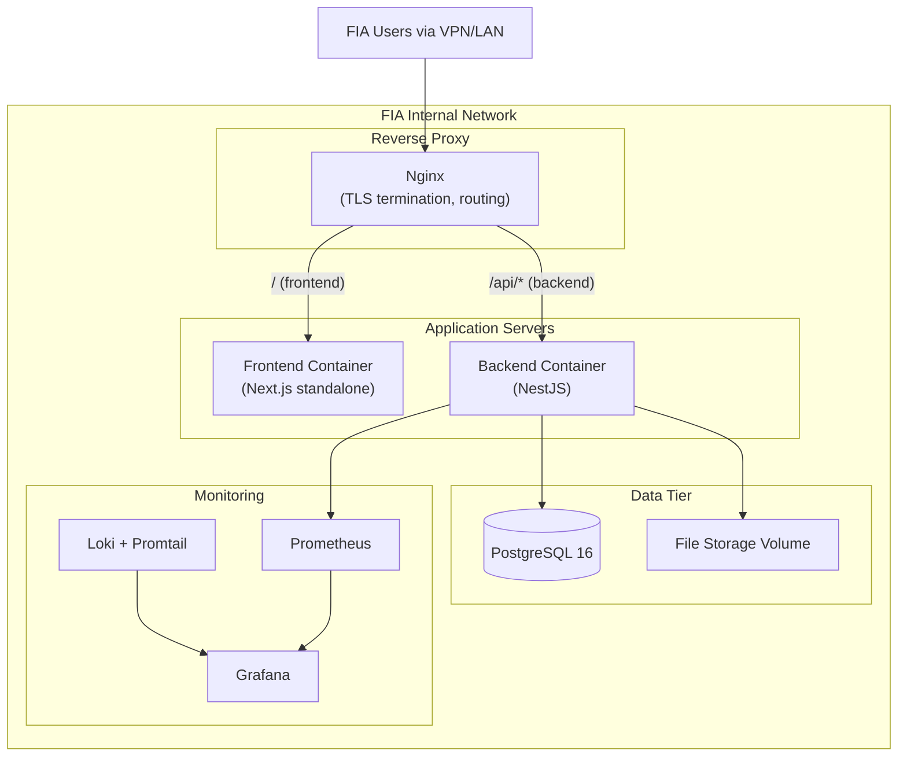

# FIA Smart ACR / PER Management System

A production-grade internal workflow platform for the Federal Investigation Agency (FIA), Pakistan. The system digitizes the Annual Confidential Report (ACR) and Performance Evaluation Report (PER) lifecycle for BPS 1-18 employees, replacing paper-based form routing with a controlled, role-gated digital workflow.

This is an internal controlled system. There is no public signup. All user accounts are provisioned by authorized administrators.

---

## Table of Contents

- [Business Problem](#business-problem)
- [Key Features](#key-features)
- [Core Roles](#core-roles)
- [System Architecture](#system-architecture)
- [Frontend Architecture](#frontend-architecture)
- [Backend Architecture](#backend-architecture)
- [Database and Data Model](#database-and-data-model)
- [Workflow and Data Flow](#workflow-and-data-flow)
- [Business Rules and Rulebook Logic](#business-rules-and-rulebook-logic)
- [API Overview](#api-overview)
- [Authentication and Session Management](#authentication-and-session-management)
- [Security and Hardening](#security-and-hardening)
- [Setup and Local Development](#setup-and-local-development)
- [Environment and Configuration](#environment-and-configuration)
- [Testing Strategy](#testing-strategy)
- [Deployment Architecture](#deployment-architecture)
- [CI/CD and Release Readiness](#cicd-and-release-readiness)
- [Production Readiness](#production-readiness)
- [Repository Structure](#repository-structure)
- [Known Limitations and Future Enhancements](#known-limitations-and-future-enhancements)
- [Additional Documentation](#additional-documentation)
- [Engineering Notes](#engineering-notes)

---

## Business Problem

FIA's ACR/PER process is a mandatory annual evaluation involving multiple stakeholders across geographically distributed offices. The paper-based process suffers from:

- **Lost or delayed forms** moving between Clerk, Reporting Officer, Countersigning Officer, and Secret Branch
- **No visibility** into where an ACR currently sits in the workflow
- **No audit trail** for who accessed or modified a form
- **Manual tracking** of overdue, returned, or incomplete reports
- **No centralized archive** for historical records and retrieval

This system replaces the manual chain with a digital, role-enforced workflow that preserves the official FIA form layouts while adding controlled editing rights, real-time status tracking, audit logging, and archival.

---

## Key Features

| Module | Description |
|--------|-------------|
| **ACR Workflow Engine** | State-machine-driven lifecycle from draft through archive with return/correction cycles |
| **6 Official Form Families** | Digital replicas of FIA forms for BPS 1-18 staff with template-specific validation |
| **Role-Based Routing** | Automatic routing between Clerk, Reporting Officer, Countersigning Officer, and Secret Branch |
| **User Management** | Admin-provisioned accounts with role assignment, scope binding, and lifecycle controls |
| **Dashboard and Queue** | Per-role views showing pending, overdue, priority, and recently acted-on ACRs |
| **Search and Filter** | By employee, service number, designation, state, date range, template, and org scope |
| **Archive and History** | Immutable archive snapshots with hash verification for finalized records |
| **Audit Logging** | Comprehensive trail of all sensitive operations with actor, role, IP, and metadata |
| **Notifications** | Workflow-driven notifications routed to the next actor in the chain |
| **Analytics** | Reporting metrics, completion rates, overdue tracking, and organizational breakdowns |
| **File Uploads** | Signature, stamp, and document attachments with MIME validation and access control |
| **PDF Export** | Client-side form rendering to PDF preserving official layout with signatures/stamps |
| **Organization Hierarchy** | Multi-level structure: Wing > Directorate > Region > Zone > Circle > Station > Branch > Cell > Office > Department |
| **Secret Branch Desk Routing** | Template-to-desk allocation (AD Secret Branch, DA1-DA4) with review/verification stages |

---

## Core Roles

| Role | Responsibility |
|------|----------------|
| `SUPER_ADMIN` | Full platform administration, user provisioning, system configuration |
| `IT_OPS` | Technical operations, user management, system health |
| `CLERK` | Initiate ACR packets, fill clerk sections, submit to Reporting Officer |
| `REPORTING_OFFICER` | Fill assessment sections, forward or return ACRs |
| `COUNTERSIGNING_OFFICER` | Countersign where required, forward to Secret Branch or return |
| `SECRET_BRANCH` | Receive, review, verify, and archive finalized records |
| `DG` | Executive read-only oversight across all records |
| `EXECUTIVE_VIEWER` | Read-only access to records and dashboards |
| `WING_OVERSIGHT` | Read-only oversight scoped to a specific wing |
| `ZONAL_OVERSIGHT` | Read-only oversight scoped to a specific zone |
| `EMPLOYEE` | View own metadata and ACR status (no form content access) |

---

## System Architecture

### High-Level Overview



### Request Flow



### Backend Module Interaction



---

## Frontend Architecture

**Stack:** Next.js 15 (App Router), React 19, TypeScript 5.8, TanStack Query v5, Tailwind CSS v4, Zod, html2canvas + jsPDF

### Page Structure

All authenticated pages live under the `(portal)` route group with shared shell layout (sidebar, header, notification panel).

| Route | Purpose |
|-------|---------|
| `/login` | Authentication |
| `/forgot-password`, `/reset-password` | Password recovery |
| `/dashboard` | Role-aware summary with ACR counts and status |
| `/acr/new` | ACR initiation (Clerk) |
| `/acr/[id]` | ACR detail with interactive form and workflow actions |
| `/queue` | Current user's pending tasks |
| `/priority`, `/overdue` | Filtered ACR views |
| `/search` | Advanced search and filtering |
| `/archive` | Historical record browsing |
| `/analytics` | Business intelligence dashboards |
| `/audit-logs` | Audit trail viewer |
| `/organization` | Org hierarchy management |
| `/user-management` | Admin user provisioning |
| `/settings`, `/profile` | User preferences and security |
| `/notifications` | Notification center |

### Form Rendering

Six template-specific form components render the official FIA form layouts:

| Component | Template Family | Notes |
|-----------|----------------|-------|
| `FormA_S121C` | ASSISTANT_UDC_LDC | 4 pages, English, countersigning required |
| `FormB_S121E` | APS_STENOTYPIST | 8 pages, bilingual, no countersigning |
| `FormC_Inspector` | INSPECTOR_SI_ASI | 6 pages, English, countersigning required |
| `FormD_Superintendent` | SUPERINTENDENT_AINCHARGE | 4 pages, bilingual, countersigning required |
| `FormE_CarDriversDespatchRiders` | CAR_DRIVERS_DESPATCH_RIDERS | 7 pages, bilingual, countersigning required |
| `FormF_Per1718Officers` | PER_17_18_OFFICERS | 11 pages, bilingual, countersigning required |

`InteractiveForm.tsx` handles the main form rendering, section-based editing rights, and form data persistence via the backend API. `FormPrimitives.tsx` provides the base elements (text inputs, checkboxes, signature pads, date pickers).

### State Management

| Concern | Approach |
|---------|----------|
| Server state | TanStack Query (React Query v5) |
| URL state | Next.js App Router search params |
| Form state | Controlled components with Zod validation |
| Auth state | Cookie-based (managed by backend) |

### Middleware

Next.js middleware (`middleware.ts`) checks JWT token expiry on each request and redirects to `/login` when the access token is expired, preserving the intended destination for post-login redirect.

---

## Backend Architecture

**Stack:** NestJS 11, TypeScript, Prisma 6.5, PostgreSQL 16, JWT (cookie-based), class-validator, Helmet, @nestjs/throttler, Multer

### Module Organization

The backend follows NestJS conventions: each domain area is a module containing a controller, service, and DTOs.

```
backend/src/
├── common/           # Shared constants, middleware, template catalog
├── config/           # Configuration loading
├── helpers/          # Security utils, view mappers, shared logic
└── modules/
    ├── acr/          # Core ACR lifecycle (create, update, transition, query)
    ├── analytics/    # Business intelligence queries
    ├── archive/      # Record finalization and snapshot creation
    ├── audit/        # Audit log writing and querying
    ├── auth/         # Authentication, sessions, password management
    ├── dashboard/    # Dashboard metrics and queue views
    ├── employees/    # Employee master data
    ├── files/        # File upload, storage, and access control
    ├── health/       # Health check and Prometheus metrics
    ├── notifications/# Workflow notifications
    ├── organization/ # Org hierarchy CRUD
    ├── settings/     # Admin and user settings
    ├── storage/      # File storage abstraction
    ├── templates/    # Form template catalog
    ├── user-assets/  # Signature and stamp management
    ├── users/        # User provisioning and lifecycle
    └── workflow/     # State machine and transition validation
```

### Key Helpers

- **`security.utils.ts`** - Core authorization logic: `canAccessAcr()`, `canEditAcrForm()`, `canTransitionAcr()`, `canAccessEmployee()`, `buildAcrAccessPreFilter()`, `effectiveScope()`
- **`view-mappers.ts`** - Response shaping: `mapAcr()`, `mapEmployee()`, `mapTimeline()`, `deriveAuditModule()`, `deriveAuditEventType()`
- **`acr-form-validation.ts`** - Template-aware form validation for each workflow stage

### Validation Strategy

- Global `ValidationPipe` with whitelist mode (`forbidNonWhitelisted: true`)
- DTOs decorated with `class-validator` constraints
- Template-specific form validation in `acr-form-validation.ts`
- Zod schemas on the frontend for client-side pre-validation

---

## Database and Data Model

### Entity-Relationship Diagram



### Core Tables

| Table | Purpose |
|-------|---------|
| `User` | System accounts with username, email, badge number, password hash, lifecycle flags |
| `UserRoleAssignment` | Maps users to roles with optional wing/zone/office scope |
| `Employee` | Employee master records (name, service number, designation, posting) |
| `AcrRecord` | Central ACR document: state, form data (JSON), period, due date, officer assignments |
| `AcrTimelineEntry` | Immutable workflow history: action, actor, status, remarks, timestamp |
| `TemplateVersion` | Form template definitions with family code, version, page count, language |
| `FileAsset` | Uploaded files (signatures, stamps, documents) linked to ACR or archive records |
| `ArchiveRecord` / `ArchiveSnapshot` | Finalized records with immutable hash and document path |
| `AuditLog` | Action, actor, role, IP, record reference, metadata JSON, timestamp |
| `Notification` | Workflow notifications with type, message, read tracking |
| `Session` | Active sessions with refresh tokens and expiry |
| `AdminSetting` | System-wide configuration as key-value JSON |

### Enums

| Enum | Values |
|------|--------|
| `UserRole` | SUPER_ADMIN, IT_OPS, CLERK, REPORTING_OFFICER, COUNTERSIGNING_OFFICER, SECRET_BRANCH, WING_OVERSIGHT, ZONAL_OVERSIGHT, DG, EXECUTIVE_VIEWER, EMPLOYEE |
| `AcrWorkflowState` | DRAFT, PENDING_REPORTING, PENDING_COUNTERSIGNING, PENDING_SECRET_BRANCH_REVIEW, PENDING_SECRET_BRANCH_VERIFICATION, RETURNED_TO_CLERK, RETURNED_TO_REPORTING, RETURNED_TO_COUNTERSIGNING, ARCHIVED |
| `TemplateFamilyCode` | ASSISTANT_UDC_LDC, APS_STENOTYPIST, INSPECTOR_SI_ASI, SUPERINTENDENT_AINCHARGE, CAR_DRIVERS_DESPATCH_RIDERS, PER_17_18_OFFICERS |
| `FileAssetKind` | SIGNATURE, STAMP, DOCUMENT |
| `SecretBranchDeskCode` | AD_SECRET_BRANCH, DA1, DA2, DA3, DA4 |
| `OrgScopeTrack` | REGIONAL, WING |

---

## Workflow and Data Flow

### Standard Workflow

```
Clerk --> Reporting Officer --> Countersigning Officer --> Secret Branch Review --> Secret Branch Verification --> Archive
```

### Non-Countersigning Workflow

```
Clerk --> Reporting Officer --> Secret Branch Review --> Secret Branch Verification --> Archive
```

### State Machine



### End-to-End Data Flow



### Return and Correction Flow

Returned records are not dead-end states. When an ACR is returned:

1. Return remarks are preserved in the timeline
2. The ACR moves to `RETURNED_TO_CLERK`, `RETURNED_TO_REPORTING`, or `RETURNED_TO_COUNTERSIGNING`
3. The responsible party can edit their sections and resubmit
4. The full return and correction chain is preserved in audit history
5. Returned states follow the same transition rules as their originating states

---

## Business Rules and Rulebook Logic

### Template Requirements

| Rule | Implementation |
|------|----------------|
| **Countersigning requirement** | Template catalog (`template-catalog.ts`) defines `requiresCountersigning` per family. APS_STENOTYPIST does not require countersigning; all others do. |
| **Official stamp requirement** | Templates define `requiresOfficialStamp` for reporting and countersigning sections. PER_17_18_OFFICERS exempts stamp requirement. |
| **Reporting period validation** | Clerk section requires `reportingPeriodFrom` and `reportingPeriodTo` dates. Validated in `getClerkSubmissionValidationMessage()`. |

### Form Validation Rules

Validation is enforced server-side in `acr-form-validation.ts` before each transition:

| Stage | Required Fields |
|-------|-----------------|
| **Clerk submission** | Reporting period dates (from/to) |
| **Reporting Officer submission** | Assessment/remarks text, signature date, signature image, official stamp (if template requires) |
| **Countersigning Officer submission** | Countersigning remarks, signature date, signature image, official stamp (if template requires) |
| **Secret Branch review** | Desk code assignment, review completion |
| **Secret Branch verification** | Verification confirmation, archive snapshot creation |

### Authorization Rules

Implemented in `security.utils.ts`:

| Rule | Logic |
|------|-------|
| **ACR access** | Administrative bypass (SUPER_ADMIN, IT_OPS), Secret Branch access, executive read-only (DG, EXECUTIVE_VIEWER), oversight roles (scoped), employee self-access (metadata only), workflow participation check |
| **Form editing** | Only the current holder in the active workflow stage can edit their section |
| **Transition authorization** | Only the current holder with the correct role for the current state can trigger transitions |
| **Employee access** | EMPLOYEE role can see own ACR metadata but not form content |
| **Scope filtering** | Wing/zone/office scope applied via `buildAcrAccessPreFilter()` |

### Secret Branch Desk Routing

- `SecretBranchRoutingRule` maps template families to desk codes (AD_SECRET_BRANCH, DA1-DA4)
- ACRs are allocated to specific desk officers upon reaching Secret Branch
- Two-stage process: review completion followed by verification/archival

### Archive Rules

- Archive creates an immutable `ArchiveSnapshot` with content hash
- Archived records cannot be transitioned further
- Archive access respects the same role-based visibility rules

---

## API Overview

All endpoints are prefixed with `/api/v1/`. Authentication is cookie-based (HttpOnly JWT tokens).

### Authentication

| Method | Endpoint | Description |
|--------|----------|-------------|
| POST | `/auth/challenge` | Request login challenge code |
| POST | `/auth/verify` | Verify challenge and establish session |
| POST | `/auth/login` | Direct username/password login |
| POST | `/auth/logout` | End session and clear cookies |
| POST | `/auth/refresh` | Refresh access token |
| POST | `/auth/switch-role` | Switch active role within session |
| POST | `/auth/forgot-password/request` | Request password reset token |
| POST | `/auth/forgot-password/reset` | Reset password with token |

### ACR Lifecycle

| Method | Endpoint | Description |
|--------|----------|-------------|
| POST | `/acr` | Create new ACR (Clerk) |
| GET | `/acr` | List ACRs (filtered by role/scope) |
| GET | `/acr/:id` | Get ACR detail with form data |
| PATCH | `/acr/:id` | Update form data |
| POST | `/acr/:id/transition` | Execute workflow transition |
| GET | `/acr/:id/timeline` | Get workflow history |

### User Management (Admin)

| Method | Endpoint | Description |
|--------|----------|-------------|
| GET | `/users` | List users (paginated, filtered) |
| GET | `/users/options` | User options for dropdowns |
| GET | `/users/:id` | User detail |
| POST | `/users` | Create user |
| PATCH | `/users/:id` | Update user |
| POST | `/users/:id/reset-password` | Admin password reset |
| POST | `/users/:id/deactivate` | Deactivate account |
| POST | `/users/:id/reactivate` | Reactivate account |

### Other API Groups

| Group | Base Path | Purpose |
|-------|-----------|---------|
| Employees | `/employees` | Employee search, CRUD, assignment |
| Organization | `/organization` | Wings, zones, offices, departments |
| Archive | `/archive` | Historical record retrieval |
| Dashboard | `/dashboard` | ACR counts, queue metrics |
| Analytics | `/analytics` | Reporting and business intelligence |
| Files | `/files` | Upload, download, access control |
| Audit | `/audit` | Audit log query with filtering |
| Notifications | `/notifications` | List, mark read, count |
| Settings | `/settings` | Admin config, user preferences |
| Templates | `/templates` | Form template catalog |
| Health | `/health` | Liveness, readiness, metrics |

---

## Authentication and Session Management

### Login Flows

**Challenge-based login (two-step):**
1. `POST /auth/challenge` returns a `challengeId` and masked destination
2. `POST /auth/verify` with the challenge code establishes the session

**Direct login:**
- `POST /auth/login` with username and password

### Session Tokens

| Token | Cookie Name | TTL | Purpose |
|-------|-------------|-----|---------|
| Access token | `acr_access_token` | 15 min (configurable) | Request authentication |
| Refresh token | `acr_refresh_token` | 7 days (configurable) | Token renewal |

Both cookies are `HttpOnly`, `SameSite`, and `Secure` in production.

### Token Payload

```typescript
{
  sub: string;   // userId
  sid: string;   // sessionId
  role: UserRole; // active role
}
```

### Password Lifecycle

- **Admin reset:** Set temporary password + force change on next login (`mustChangePassword`)
- **Self-service change:** User provides current password and new password via settings
- **Forgot password:** Token-based reset (delivery integration is a deployment concern)

---

## Security and Hardening

### Access Control

- **Deny-by-default:** No public endpoints except auth and health
- **JWT Auth Guard:** Validates cookie token and session state on every protected request
- **Roles Guard:** Enforces role requirements per endpoint
- **Record-level authorization:** `canAccessAcr()`, `canAccessEmployee()` check workflow participation and scope
- **Scope-based filtering:** Database queries are pre-filtered by user's wing/zone/office scope

### Rate Limiting

Rate limiting is enforced via `@nestjs/throttler` on sensitive endpoints:

| Endpoint Group | Short Window (1s) | Medium Window (60s) | Rationale |
|---------------|-------------------|---------------------|-----------|
| `/auth/challenge` | 3 requests | 10 requests | Prevent brute-force login attempts |
| `/auth/verify` | 3 requests | 10 requests | Prevent challenge code guessing |
| `/auth/login` | 3 requests | 10 requests | Prevent credential stuffing |
| `/auth/forgot-password/request` | 2 requests | 5 requests | Prevent token flooding |
| `/auth/forgot-password/reset` | 2 requests | 5 requests | Prevent reset brute-force |

Rate limiting is applied per-IP. Auth endpoints are the highest risk and have the strictest limits.

### Security Headers

- **Helmet** middleware enabled (CSP disabled for form rendering; all other protections active)
- **CORS:** Restricted to `WEB_ORIGIN` with credentials
- **Cookie flags:** HttpOnly, SameSite, Secure (production)

### Validation

- Global `ValidationPipe` with whitelist and `forbidNonWhitelisted`
- DTO validation via `class-validator` decorators
- File upload MIME type verification via `file-type` library
- Template-specific form validation before workflow transitions

### Audit Trail

All sensitive operations are logged to the `AuditLog` table:
- Login/logout, role switches
- ACR creation, transitions, returns
- Form data updates, file uploads
- User provisioning, deactivation, password resets
- Archive operations, settings changes

Each entry captures: action, actorId, actorRole, ipAddress, recordType, recordId, details, metadata, timestamp.

### File Upload Security

- MIME type whitelist enforcement
- File size limits
- Access control: ACR-linked files require `canAccessAcr()`, archive files require `canAccessEmployee()`, user assets are owner-only
- EMPLOYEE role cannot access document files (metadata only)

---

## Setup and Local Development

### Prerequisites

- Node.js 22+ (LTS)
- pnpm 10+
- PostgreSQL 16 (or use Docker)
- Git

### Quick Start

```bash
# Clone and install
git clone <repository-url>
cd smart-acr
pnpm install

# Start infrastructure (PostgreSQL, Redis, MinIO)
pnpm docker:up

# Backend setup
cd backend
cp .env.example .env
pnpm prisma:generate
pnpm prisma:push
pnpm prisma:seed        # Seeds development accounts
cd ..

# Frontend setup
cd frontend
cp .env.example .env
cd ..

# Run both services
pnpm dev
```

Frontend runs on `http://localhost:3000`, backend on `http://localhost:4000`.

### Available Commands

| Command | Description |
|---------|-------------|
| `pnpm dev` | Start frontend + backend concurrently |
| `pnpm build` | Production build (all packages) |
| `pnpm test` | Run all tests |
| `pnpm typecheck` | TypeScript check (all packages) |
| `pnpm lint` | Lint all packages |
| `pnpm seed` | Seed development data |
| `pnpm db:generate` | Generate Prisma client |
| `pnpm db:push` | Push schema to database (no migration) |
| `pnpm db:migrate` | Create and apply migrations |
| `pnpm docker:up` | Start Docker infrastructure |
| `pnpm docker:down` | Stop Docker infrastructure |
| `pnpm deploy:onprem` | Deploy on-premises |
| `pnpm rollback:onprem` | Rollback on-premises deployment |
| `pnpm backup:onprem` | Backup PostgreSQL database |

### Seeded Development Accounts

Seed data provides bootstrap accounts for local development. In production, all users are provisioned through the admin user management interface.

**Shared development password:** `ChangeMe@123`

| Name | Role | Username / Email |
|------|------|-----------------|
| Hamza Qureshi | SUPER_ADMIN, IT_OPS | `it.ops` / `it.ops@fia.gov.pk` |
| Zahid Ullah | CLERK | `zahid.ullah@fia.gov.pk` |
| Muhammad Sarmad | REPORTING_OFFICER | `muhammad.sarmad@fia.gov.pk` |
| Afzal Khan SSP | COUNTERSIGNING_OFFICER | `afzal.khan@fia.gov.pk` |
| Nazia Ambreen | SECRET_BRANCH | `nazia.ambreen@fia.gov.pk` |
| Dr Anwar Saleem | DG | `dr.anwar.saleem@fia.gov.pk` |

---

## Environment and Configuration

### Backend (`backend/.env`)

| Variable | Required | Default | Description |
|----------|----------|---------|-------------|
| `NODE_ENV` | Yes | `development` | Environment mode |
| `PORT` | Yes | `4000` | API server port |
| `DATABASE_URL` | Yes | - | PostgreSQL connection string |
| `POSTGRES_DB` | No | `smart_acr` | Database name (Docker) |
| `POSTGRES_USER` | No | `postgres` | Database user (Docker) |
| `POSTGRES_PASSWORD` | No | `postgres` | Database password (Docker) |
| `JWT_ACCESS_SECRET` | Yes | - | Access token signing secret |
| `JWT_REFRESH_SECRET` | Yes | - | Refresh token signing secret |
| `ACCESS_TOKEN_TTL` | No | `15m` | Access token lifetime |
| `REFRESH_TOKEN_TTL_DAYS` | No | `7` | Refresh token lifetime in days |
| `WEB_ORIGIN` | Yes | - | Frontend origin for CORS |
| `STORAGE_PATH` | Yes | `storage` | Local file storage directory |
| `FORGOT_PASSWORD_ENABLED` | No | `false` | Enable forgot-password flow |
| `FORGOT_PASSWORD_TOKEN_TTL_MINUTES` | No | `30` | Reset token expiry |

### Frontend (`frontend/.env`)

| Variable | Required | Description |
|----------|----------|-------------|
| `NEXT_PUBLIC_API_URL` | Yes | Backend API base URL (`http://localhost:4000/api/v1` for dev, `/api/v1` for reverse proxy) |

---

## Testing Strategy

### Test Suite

| Category | Framework | Location | Command |
|----------|-----------|----------|---------|
| Backend unit tests | Jest + ts-jest | `backend/src/**/*.spec.ts` | `pnpm --filter @smart-acr/backend test` |
| Frontend component tests | Jest | `frontend/src/**/*.spec.tsx` | `pnpm --filter @smart-acr/frontend test` |
| Type checking | TypeScript | All packages | `pnpm -r typecheck` |
| Build verification | Next.js / NestJS | All packages | `pnpm build` |

### Test Coverage Areas

| Area | Tests |
|------|-------|
| Authentication | `auth.service.spec.ts` - Login, sessions, token management |
| Password reset | `auth.password-reset.spec.ts` - Reset flow, token validation |
| ACR lifecycle | `acr.service.spec.ts` - Creation, updates, queries |
| Form validation | `acr-form-validation.spec.ts` - Template-specific validation rules |
| Workflow transitions | `workflow.service.spec.ts` - State machine, valid/invalid transitions |
| Authorization | `security.utils.spec.ts` - Role checks, scope filtering, access control |
| File uploads | `upload.constants.spec.ts` - MIME validation, size limits |
| Form components | `form-templates.spec.tsx` - Frontend form rendering |

### Pre-Release Validation

```bash
# Run all quality gates
pnpm -r typecheck              # Type safety
pnpm --filter @smart-acr/backend test   # Backend tests
pnpm --filter @smart-acr/frontend test  # Frontend tests
pnpm build                     # Production build
```

### Recommended Additional Testing

- **Playwright E2E:** Full workflow automation (login -> initiate ACR -> route through all stages -> archive)
- **Role-based access:** Verify each role can only access authorized endpoints and UI areas
- **Workflow edge cases:** Return cycles, concurrent access, state transition validation
- **Security:** Authentication bypass attempts, authorization escalation, input injection

---

## Deployment Architecture

### On-Premises Deployment (Primary)



### Docker Compose Stack

**Development:** `infra/docker/docker-compose.yml` - PostgreSQL, Redis, MinIO, backend, frontend

**Production:** `infra/docker/docker-compose.onprem.yml` - Full stack with Nginx reverse proxy, monitoring

**Monitoring:** `infra/docker/docker-compose.monitoring.yml` - Prometheus, Grafana, Loki, Promtail

### Deployment Scripts

| Script | Purpose |
|--------|---------|
| `infra/scripts/deploy-onprem.sh` | Deploy or update the on-premises stack |
| `infra/scripts/rollback-onprem.sh` | Rollback to previous version |
| `infra/scripts/backup-onprem.sh` | PostgreSQL backup |
| `infra/scripts/restore-onprem.sh` | Restore from backup |
| `infra/scripts/post-deploy-smoke.sh` | Health check verification |

### Container Images

Both backend and frontend use multi-stage Docker builds on Node 22 bookworm-slim with a non-root user (`smartacr`, UID 1001). Health checks are built into the container definitions.

---

## CI/CD and Release Readiness

### Quality Gates (Pre-Merge)

```bash
pnpm lint                      # Linting
pnpm -r typecheck              # Type checking
pnpm --filter @smart-acr/backend test   # Backend tests
pnpm --filter @smart-acr/frontend test  # Frontend tests
pnpm build                     # Build verification
```

### Release Flow

1. **Feature branch** -> develop on branch, run all quality gates
2. **Migration check** -> `pnpm db:migrate` if schema changed
3. **Build** -> `pnpm build` for both packages
4. **Deploy** -> `pnpm deploy:onprem` or manual Docker Compose
5. **Smoke test** -> `infra/scripts/post-deploy-smoke.sh`
6. **Rollback** -> `pnpm rollback:onprem` if issues detected

### Migration Strategy

- Prisma migrations live in `backend/prisma/migrations/`
- `pnpm db:migrate` creates new migration files
- `prisma migrate deploy` applies pending migrations in production
- Always test migrations against a staging database before production

---

## Production Readiness

### Completed

- Full-stack role-based workflow with 6 official form families
- Admin-driven user provisioning (no seed dependency in production)
- Cookie-based JWT authentication with session management
- Rate limiting on authentication and password endpoints
- Helmet security headers
- Global input validation with whitelist enforcement
- Comprehensive audit logging
- Archive snapshots with hash verification
- File upload MIME validation and access control
- On-premises Docker deployment with Nginx reverse proxy
- Monitoring stack (Prometheus, Grafana, Loki)
- Database backup and restore scripts
- Deployment and rollback automation

### Changes from Prototype

| Area | Before | Now |
|------|--------|-----|
| User creation | Seed-only | Admin UI provisioning with lifecycle management |
| Form families | 4 templates | 6 templates covering BPS 1-18 |
| Workflow states | Simplified | Full state machine with Secret Branch review/verification |
| Security | Basic guards | Rate limiting, Helmet, CORS, scope-based filtering |
| Deployment | Manual | Automated Docker with monitoring and rollback |
| Testing | Minimal | Unit tests across auth, workflow, validation, security |

---

## Repository Structure

```text
smart-acr/
├── backend/
│   ├── prisma/
│   │   ├── schema.prisma          # Database schema
│   │   ├── migrations/            # Migration history
│   │   └── seed.ts                # Development seed data
│   └── src/
│       ├── common/                # Shared constants, middleware, catalog
│       ├── config/                # Configuration module
│       ├── helpers/               # Security utils, view mappers
│       ├── modules/               # NestJS feature modules (18 modules)
│       ├── app.module.ts          # Root module
│       └── main.ts                # Application bootstrap
├── frontend/
│   └── src/
│       ├── api/                   # API client layer
│       ├── app/                   # Next.js App Router pages
│       │   ├── (auth)/            # Login, password reset
│       │   └── (portal)/          # Authenticated portal pages
│       ├── components/            # UI components
│       │   ├── forms/             # 6 template form components
│       │   ├── dashboard/         # Dashboard widgets
│       │   ├── users/             # User management UI
│       │   └── ui/                # Shared UI primitives
│       ├── providers/             # App and shell providers
│       ├── templates/             # Template definitions
│       └── utils/                 # Utility functions
├── docs/
│   ├── architecture/              # System architecture docs
│   ├── deployment/                # Deployment guides and checklists
│   ├── forms/                     # Official form references
│   └── testing/                   # Validation reports
├── infra/
│   ├── docker/                    # Docker Compose, Dockerfiles, Nginx
│   │   ├── monitoring/            # Prometheus, Grafana, Loki config
│   │   └── nginx/                 # Reverse proxy configuration
│   └── scripts/                   # Deploy, rollback, backup scripts
├── scripts/                       # Utility scripts
├── package.json                   # Workspace root
├── pnpm-workspace.yaml            # pnpm workspace config
└── tsconfig.base.json             # Shared TypeScript config
```

---

## Known Limitations and Future Enhancements

### Current Limitations

- **Email/SMS delivery** for forgot-password is not integrated (structure exists, delivery is a deployment concern)
- **Server-side PDF export** may require Chromium availability in the deployment environment; client-side fallback is available
- **Directory integration** (LDAP/Active Directory) is not yet implemented
- **Real-time notifications** use polling; WebSocket upgrade is planned

### Future Enhancements

- Playwright E2E test suite for full workflow automation
- LDAP/Active Directory integration for user provisioning
- Email/SMS notification delivery
- Adverse remarks and representation window workflow
- Enhanced analytics with exportable reports
- Mobile-responsive improvements
- Cloud deployment path (Azure/AWS)
- Formalize department/branch as master tables

---

## Additional Documentation

| Document | Path |
|----------|------|
| Architecture Overview | [docs/architecture/overview.md](docs/architecture/overview.md) |
| Workflow Rules | [docs/architecture/workflow.md](docs/architecture/workflow.md) |
| Reuse and Migration Notes | [docs/architecture/reuse-and-migration.md](docs/architecture/reuse-and-migration.md) |
| Deployment Strategy | [docs/deployment/FIA-Smart-ACR-Deployment-Strategy.md](docs/deployment/FIA-Smart-ACR-Deployment-Strategy.md) |
| On-Prem Operations | [docs/deployment/OnPrem-Operations.md](docs/deployment/OnPrem-Operations.md) |
| Release Checklist | [docs/deployment/Release-Checklist.md](docs/deployment/Release-Checklist.md) |
| System Validation Report | [docs/testing/system-validation-2026-04-05.md](docs/testing/system-validation-2026-04-05.md) |
| Official Form References | [docs/forms/](docs/forms/) |
| Project Proposal | [docs/FIA_ACR_Project_Proposal_Revised_April_2026.pdf](docs/FIA_ACR_Project_Proposal_Revised_April_2026.pdf) |
| Software Requirements Specification | [docs/FIA_ACR_SRS_Revised_April_2026.pdf](docs/FIA_ACR_SRS_Revised_April_2026.pdf) |

---

## Engineering Notes

### Adding Features

1. Create a feature branch from `main`
2. Add Prisma schema changes -> run `pnpm db:migrate`
3. Implement backend module (controller, service, DTOs)
4. Add corresponding frontend pages/components
5. Write tests covering the new functionality
6. Run all quality gates: `pnpm typecheck && pnpm test && pnpm build`
7. Submit PR with clear description of changes

### Business Rule Alignment

When modifying workflow logic or form validation:
- Review `backend/src/modules/workflow/workflow.service.ts` for state transitions
- Review `backend/src/modules/acr/acr-form-validation.ts` for form rules
- Review `backend/src/common/template-catalog.ts` for template requirements
- Review `backend/src/helpers/security.utils.ts` for authorization rules
- Ensure changes are reflected in both backend validation and frontend UI

### Commit Convention

```
<type>: <description>

Types: feat, fix, refactor, docs, test, chore, perf, ci
```
