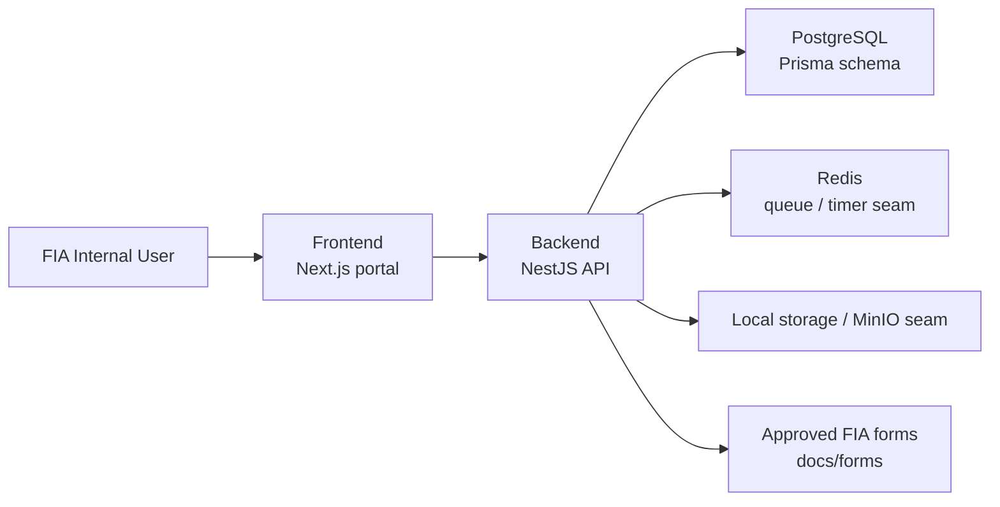
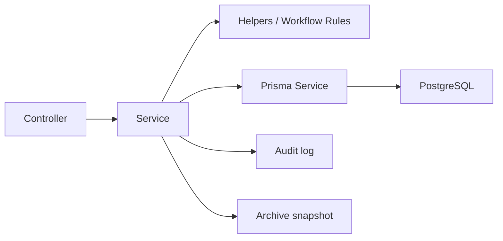

# FIA Smart ACR / PER Management System

Internal workflow system for the Federal Investigation Agency (FIA), Pakistan, to digitize ACR / PER processing for BPS 1-16 staff. The repository is now organized around two independently runnable applications:

- `backend/`
- `frontend/`

## Final repository structure

```text
smart-acr/
  backend/
    prisma/
    src/
      @types/
      config/
      helpers/
      common/
      modules/
    .env.example
    .gitignore
    biome.json
    docker-compose.yml
    Dockerfile
    package.json
    README.md
    tsconfig.json
  frontend/
    public/
    src/
      @types/
      api/
      app/
      components/
      hooks/
      providers/
      templates/
      themes/
      validators/
    .env.example
    .gitignore
    biome.json
    Dockerfile
    package.json
    README.md
    tsconfig.json
  docs/
    architecture/
    forms/
  infra/
    docker/
  .env.example
  .gitignore
  package.json
  pnpm-workspace.yaml
  tsconfig.base.json
```

## System architecture



## Business workflow

### Standard flow

`Clerk -> Reporting Officer -> Countersigning Officer -> Secret Branch -> Archive`

### APS / Stenotypist exception

`Clerk -> Reporting Officer -> Secret Branch -> Archive`

### Implemented states

- `Draft`
- `Pending Reporting`
- `Pending Countersigning`
- `Submitted to Secret Branch`
- `Archived`
- `Returned`

`Overdue` is derived from due date and active workflow state.

## Backend architecture

The backend is in [backend/](/D:/All%20AI%20Projects/smart-acr/backend) and is the system authority for:

- authentication
- role-based access
- workflow transitions
- employee and organization data
- archive state
- audit events
- notifications
- analytics
- file upload entry points

### Backend structure

- [backend/prisma](/D:/All%20AI%20Projects/smart-acr/backend/prisma)
  Prisma schema, migrations, and seed data.
- [backend/src/@types](/D:/All%20AI%20Projects/smart-acr/backend/src/@types)
  Shared backend-facing TypeScript interfaces.
- [backend/src/config](/D:/All%20AI%20Projects/smart-acr/backend/src/config)
  Environment validation and configuration helpers.
- [backend/src/helpers](/D:/All%20AI%20Projects/smart-acr/backend/src/helpers)
  Reusable business helpers such as security access checks and response mappers.
- [backend/src/common](/D:/All%20AI%20Projects/smart-acr/backend/src/common)
  NestJS decorators, guards, and Prisma service wiring.
- [backend/src/modules](/D:/All%20AI%20Projects/smart-acr/backend/src/modules)
  Feature modules containing controllers, services, DTOs, and module registration.

### Backend module map

- `auth`
- `acr`
- `workflow`
- `dashboard`
- `employees`
- `organization`
- `templates`
- `archive`
- `notifications`
- `audit`
- `analytics`
- `settings`
- `files`
- `health`

### Backend request flow



### Backend architecture note

Your example structure is layer-oriented. Because this backend uses NestJS, the final shape is a hybrid:

- top-level technical folders for shared concerns such as `config`, `helpers`, and `@types`
- feature modules under `src/modules` for scalability and clean NestJS composition

That gives us the cleaner backend/frontend split you asked for, while keeping Nest conventions intact.

## Frontend architecture

The frontend is in [frontend/](/D:/All%20AI%20Projects/smart-acr/frontend) and is individually runnable. It uses Next.js App Router instead of a Vite `main.tsx/app.tsx` bootstrap, so the exact folder names are adapted to Next.js while still following the intent of your preferred structure.

### Frontend structure

- [frontend/src/@types](/D:/All%20AI%20Projects/smart-acr/frontend/src/@types)
  Shared frontend contracts and DTO-style interfaces.
- [frontend/src/api](/D:/All%20AI%20Projects/smart-acr/frontend/src/api)
  Backend communication layer.
- [frontend/src/app](/D:/All%20AI%20Projects/smart-acr/frontend/src/app)
  Next.js route tree and page entry points.
- [frontend/src/components](/D:/All%20AI%20Projects/smart-acr/frontend/src/components)
  Reusable UI and form components.
- [frontend/src/hooks](/D:/All%20AI%20Projects/smart-acr/frontend/src/hooks)
  Reusable hooks such as shell access.
- [frontend/src/templates](/D:/All%20AI%20Projects/smart-acr/frontend/src/templates)
  Layout wrappers such as `AppShell`.
- [frontend/src/themes](/D:/All%20AI%20Projects/smart-acr/frontend/src/themes)
  Extracted FIA theme and font CSS.
- [frontend/src/validators](/D:/All%20AI%20Projects/smart-acr/frontend/src/validators)
  Frontend validation schemas such as login validation.

### Frontend pages currently implemented

- login
- dashboard
- queue
- search
- archive
- notifications
- audit logs
- organization
- analytics
- settings
- form templates
- priority
- overdue
- ACR initiation
- ACR detail
- review flow

### Extracted design assets

The frontend now directly owns the previously extracted FIA design pieces:

- `FIALogo`
- `StatusChip`
- `StatCard`
- `Timeline`
- printable FIA form components
- theme tokens
- Urdu/form styling rules

These now live inside `frontend/src` rather than in a separate reference folder.

## Data architecture

The Prisma schema currently models:

- `Wing`
- `Zone`
- `Office`
- `User`
- `UserRoleAssignment`
- `Session`
- `Employee`
- `TemplateVersion`
- `AcrRecord`
- `AcrTimelineEntry`
- `Notification`
- `AuditLog`
- `FileAsset`
- `ArchiveSnapshot`
- `AdminSetting`

## Security architecture

- backend-enforced authorization
- deny-by-default protected actions
- cookie-based access and refresh token handling
- server-side workflow validation
- archive snapshot seam for immutable records
- no frontend-only security assumptions
- public self-registration is intentionally disabled for privileged FIA roles
- Clerk, Reporting Officer, Countersigning Officer, Secret Branch, and DG access are provisioned through seed data or controlled internal onboarding only

## Local development

### Run backend only

```bash
cd backend
docker compose up -d postgres redis minio
pnpm install
pnpm db:generate
pnpm db:push
pnpm seed
pnpm dev
```

### Run frontend only

```bash
cd frontend
pnpm install
pnpm dev
```

### Run both together

Start the shared infrastructure first if you are not already running PostgreSQL, Redis, and MinIO:

```bash
docker compose -f backend/docker-compose.yml up -d postgres redis minio
pnpm dev
```

### Root utility commands

```bash
pnpm typecheck
pnpm test
pnpm build
pnpm db:generate
pnpm db:push
pnpm db:migrate
pnpm seed
pnpm docker:up
pnpm docker:down
```

## Docker

### Full stack compose

[infra/docker/docker-compose.yml](/D:/All%20AI%20Projects/smart-acr/infra/docker/docker-compose.yml)

Services:

- `postgres`
- `redis`
- `minio`
- `backend`
- `frontend`

### Backend-only compose

[backend/docker-compose.yml](/D:/All%20AI%20Projects/smart-acr/backend/docker-compose.yml)

Services:

- `postgres`
- `redis`
- `minio`
- `backend`

## Environment files

- [root `.env.example`](/D:/All%20AI%20Projects/smart-acr/.env.example)
- [backend `.env.example`](/D:/All%20AI%20Projects/smart-acr/backend/.env.example)
- [frontend `.env.example`](/D:/All%20AI%20Projects/smart-acr/frontend/.env.example)

## Demo Seeded Users / Login Credentials

The demo seed provisions internal FIA role accounts for the full ACR workflow. These are development-only credentials and must be replaced in any real environment.

### Run the seed

From the repository root:

```bash
pnpm seed
```

From the backend package directly:

```bash
cd backend
pnpm prisma:seed
```

### Sign in after seeding

Open the login page and use any seeded email, username, or badge number together with the shared development password shown below.

| Name | Role | Email | Password | Access |
|------|------|-------|----------|--------|
| Zahid Ullah | CLERK | `zahid.ullah@fia.gov.pk` | `ChangeMe@123` | Initiates ACRs, fills the initial section, submits to the reporting officer, and tracks workflow status. |
| Muhammad Sarmad | REPORTING_OFFICER | `muhammad.sarmad@fia.gov.pk` | `ChangeMe@123` | Reviews assigned ACRs, completes reporting remarks, signs, and forwards records onward. |
| Afzal Khan SSP | COUNTERSIGNING_OFFICER | `afzal.khan@fia.gov.pk` | `ChangeMe@123` | Handles countersigning queues, adds countersigning remarks, signs, and submits finalized records to Secret Branch when required. |
| Nazia Ambreen | SECRET_BRANCH_OFFICER | `nazia.ambreen@fia.gov.pk` | `ChangeMe@123` | Receives finalized records, searches controlled history, and manages archive and retrieval operations. |
| Dr Anwar Saleem | DG_VIEWER | `dr.anwar.saleem@fia.gov.pk` | `ChangeMe@123` | Read-only leadership access for dashboards, trends, analytics, backlog visibility, and overdue oversight. |

### Internal onboarding rules

- This is an internal role-controlled FIA system.
- Public signup is disabled in the current application.
- Privileged roles are not self-registered; they are seeded or provisioned through controlled admin onboarding only.
- Demo credentials are for local development and walkthroughs only.
- Passwords must be changed or replaced before any non-demo deployment.

## Verification completed

Verified in the current structure:

```bash
pnpm typecheck
pnpm test
pnpm build
pnpm --filter @smart-acr/backend test:e2e
docker compose -f infra/docker/docker-compose.yml config
docker compose -f backend/docker-compose.yml config
```

## Current gaps

Still prepared but not fully finished:

- production-grade server-side PDF rendering
- exact signature and stamp placement pipeline
- deeper live end-to-end tests against a seeded running database
- optional LDAP / AD adapter

## Additional docs

- [Architecture overview](/D:/All%20AI%20Projects/smart-acr/docs/architecture/overview.md)
- [Reuse and migration notes](/D:/All%20AI%20Projects/smart-acr/docs/architecture/reuse-and-migration.md)
- [Workflow rules](/D:/All%20AI%20Projects/smart-acr/docs/architecture/workflow.md)
